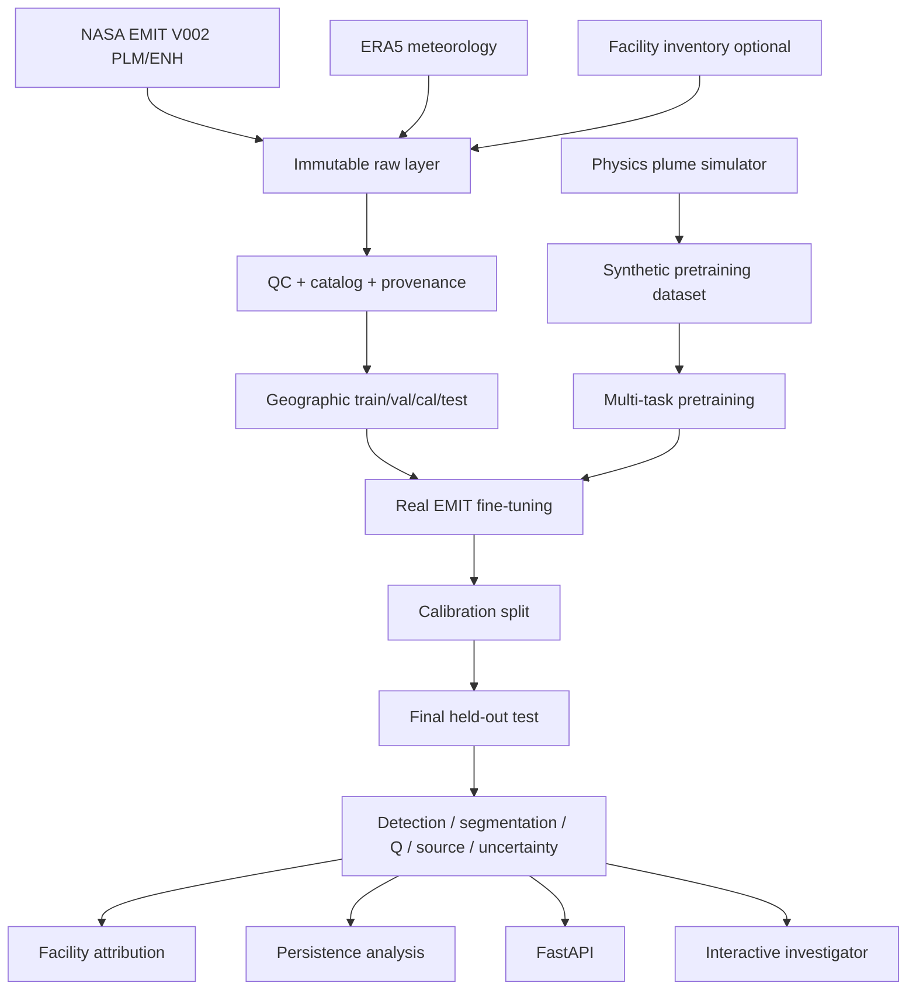

# Architecture

```mermaid
flowchart TD
    A[NASA EMIT V002 PLM/ENH] --> D[Immutable raw layer]
    B[ERA5 meteorology] --> D
    C[Facility inventory optional] --> D
    D --> E[QC + catalog + provenance]
    E --> F[Geographic train/val/cal/test]
    G[Physics plume simulator] --> H[Synthetic pretraining dataset]
    H --> I[Multi-task pretraining]
    F --> J[Real EMIT fine-tuning]
    I --> J
    J --> K[Calibration split]
    K --> L[Final held-out test]
    L --> M[Detection / segmentation / Q / source / uncertainty]
    M --> N[Facility attribution]
    M --> O[Persistence analysis]
    M --> P[FastAPI]
    M --> Q[Interactive investigator]
```
